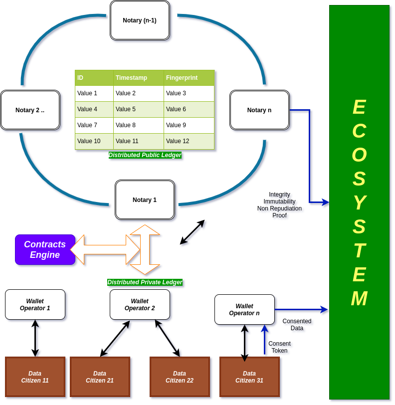

# Information Architecture for a Public Private Ledger

## Motivation:

Current model of information storage depends upon each party storing its own version of information into its silo. It is natural for any entity to trust its own systems and its own representation of information. This often works when different systems within the ecosystem of one party collaborate to share the data with each other, data that is trusted and relied upon within this ecosystem. 

However in an increasingly interconnected world, an underlying necessity to automated workflows across parties requires real time data interchange between parties. This creates a few issues. 

* Consistency: This could manifest itself in multiple forms. At the very point of first record, the two parties may have different understanding of the event and thus may record data that is not equal to each other. Even if such records were correct at that point in time errors in future workflows could result in such data diverging from each other in different silos. Finally there always remains the possibility of malicious modification for some gains. 
* Database of Record, and issues with reconciliation: Given that there are not just two copies of data across two parties, there could be multiple copies of data within the same party's ecosystem across multiple information systems. This leads to complex reconciliation issues and workflows to resolve them
* Provenance and Evolution: Sometimes workflows require to review the audit trail around how the data change all the way to its origin. These are often embedded into a variety of systems. 

## Can a distributed public ledger help?

The significant innovations in distributed ledger technologies encouraged by crypto currencies could perhaps be helpful in this regard (probably the reason for the significant investment into what are sometimes termed as blockchain technologies). This technology ensures a consistent view of data across parties, ensure that there is always a reference for being able to trace the provenance and evolution. There are a couple of issues with this

* Privacy: The default (but not the only) way of using blockchain is to push all the auditable information onto a public ledger which has multiple copies. This could be a show stopper for many kinds of data. Permissioned DLTs could help but they also require some with "superpowers" and also that the private data to be shared with with such parties. This could be useful for a small close knit group of counterparties, but may be difficult to extend across the board. 
* Control: Pushing the data on a public ledger means parties lose control over who can access that data. Even if protected by encryption, this could mean potential loss of privacy far out in the future when computation power could overwhelm contemporary encryption. (Also a successful hack against any standardised encryption could result into the entire data being at risk).
* Scalability: Some of the process elements such as proof of work require significant computational power (much of it redundant because multiple parties are competing to do the same work). Not only does this have implications in terms of power usage and climate change, it substantially impacts the scalability. An associated impact also is the associated latency to assumed finality.
* Finality: Again the blockchain set of technologies make data integrity probablistic with there never being a probability of 100% confidence being ever gained. While advanced and nuance aware users can deal with with, for most lay people the notion of finality is quite important. 
* Migration path and costs: While not entirely clear, it would be likely that each party would need to invest substantially into migration towards a distributed public ledger. However if the problem is clarified based on a set of shared schema definitions and a consistent API that all parties can communicate with, then not only could these costs be reduced, specialist companies could invest into products that have standard implementations in this space and further into integration with the private systems of each party.

## A public private ledger :

The proposed system has two ledger systems .. one public, one private. 

```

```

The private ledgers are maintained and operated by a set of entities called _wallet operators_ who understand the shared protocol and maintain the private data for and on behalf of their clients ( _data citizens_ ). They ensure that in a transaction involving multiple wallet operators, each one stores the same copy of the data that remains immutable. They also ensure the cross references across different schemas, and versions of data. 

To further support the integrity and non repudiability of the system, the wallet operators collaborate with a notary who in turn is a part of a federated cluster of notaries. The notaries then keep track of the data managed by the wallets along with the zero knowledge proofs that would support the ability to assert some facts about the data (including but not limited to its comprehensive correctness), and any further smart contracts on that data (which could for example allow data to be shared with yet another party on a particular event happening). The contracts engine is also managed by the notaries. 

Every piece of data has private and public parts (the slider could move all the way between 0% to 100%). The public parts are shared with the notary and recorded on the public ledger which itself is fully distributed across all the notaries. 

While the private part is kept only with the relevant wallet providers, it is injected with additional fingerprints from the notary and peer wallet providers to maintain the cross referencing and data evolution integrity. This ensures that all citizens possess their own data with identical levels of integrity. Thus as an example my version of my bank statement can be trusted just as much as the bank's version of my account with it. 

An important aspect of this system, is that every citizen in a transaction keeps his own data with his wallet operator (one or many), who is that participant's agent. Thus ad hoc data sharing can also be initiated directly by the citizen without involving separate data providers, and the wallet operator can forward the data consistent with the citizen's request and consent. Further automated data sharing can also be supported just as easily, as required by smart contracts.

