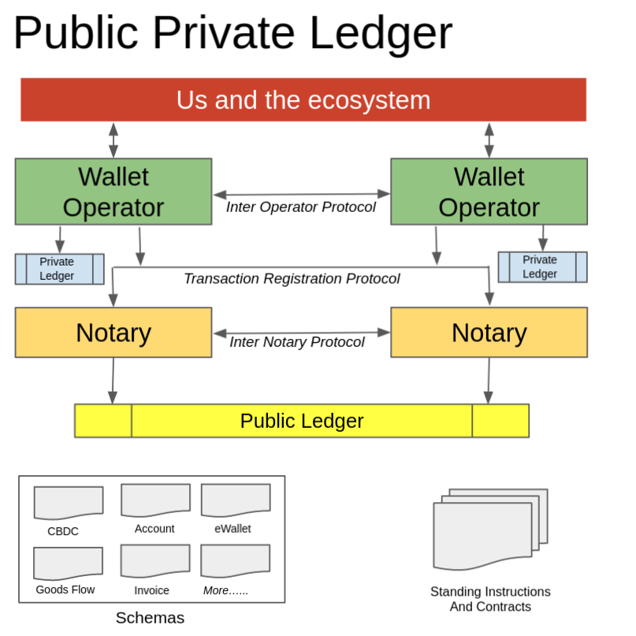

# Public Private Ledger Overview

The public private ledger proposal is a privacy supporting, trust enhancing mechanism of coordinating economic activity, and information recording and sharing. What is now a PPL proposal, started out of a process to explore the domain around and figure out the appropriate model support CBDC, support data sharing between participants, and coordination and automation of event based standing instructions across events in the goods and services ecosystem and/or money flow.

## Current Situation

 Before we get into the structure and mechanics of PPL and how it supports the various objective a brief summary of how things stand today.

**State of Digital Financial Inclusion:** India has achieved impressive numbers in terms of number of people with bank accounts (83%) and its payment infrastructure. This is a significant improvement over the recent past. However the state of broad inclusion across the board is not as impressive. For example [7% of the individuals had any kind of loan with a financial institution in 2017](https://www.statista.com/statistics/943413/india-share-people-borrow-credit-financial-institutions-by-population-type/). Some of the reasons of this imbalanced level of inclusion are unavailability of suitable financial products, digital literacy, unaffordable technology (eg smartphones), regulatory push being limited only towards reaching targets. Perhaps the elephant in the room is that given 81% population works for the informal sector and the dominance of the cash economy, most of the transactions are cash which necessarily remain outside the system and do not help in producing the necessary information collateral for a greater formal participation. 

**Strong electronic payments infrastructure with high cash demand:** While on one hand India has a rather advanced payment infrastructure with multiple channels being available 24*7 and 2.7 billion transactions being conducted on UPI alone, it also has a high demand for physical cash.

| Country | M0                                                       | GDP                    |        | References                                                   |
| ------- | -------------------------------------------------------- | ---------------------- | ------ | ------------------------------------------------------------ |
| India   | 28 Trillion Rupees (*currency with public*- not M0) | 197.46 Trillion Rupees | 14.18% | https://rbi.org.in/Scripts/BS_PressReleaseDisplay.aspx?prid=51756 https://statisticstimes.com/economy/country/india-gdp.php |
| UK      | 96.3 Billion GDP                                         | 1.96 Trillion GBP      | 4.9%   | https://tradingeconomics.com/united-kingdom/money-supply-m0 https://www.statista.com/statistics/281744/gdp-of-the-united-kingdom/ |
| China   | 8.42 Trillion Yuan                                       | 101.6 Trillion Yuan    | 8.27%  | https://tradingeconomics.com/china/money-supply-m0 http://www.xinhuanet.com/english/2021-01/18/c_139677413.htm |

It could be argued that one of the reasons cash continues to be in high demand is that it is extremely convenient to use especially for a number of people who do not find themselves adequately included or supported by formal banking systems for reasons of access, literacy or possession of necessary devices. Thus introduction of digital currency in India which could simultaneously help bridge some of these limitations (through usability improvements) could arguably be more beneficial than introduction of the same in other countries. 

It has also been often considered that the significantly higher level of cash is necessary because of a substantial part of the economy being what is colloquially termed as the black economy.  Estimates have ranged wildly between 7%-120% of the GDP as communicated by the revenue secretary to the Standing Committee on Finance. What can be said with confidence is that it is ***large***. In fact the very fact that estimates are wildly fluctuating is an indication of another issue, which is that cash lends itself opaque to monitoring capabilities for the purposes of compliance with law or monitoring economic activity. It could also be argued that what actually increased usage of digital currency can improve the propensity of people to further increase use of electronic channels leading to a higher utilisation of formal

**Privacy:** While on one hand The Supreme Court of India has upheld the right to privacy as a fundamental right, it has acknowledged support for state action to the contrary on the grounds of doctrine of proportionality based on a three part test requiring a legitimate state aim, a legislation sanctioning the action and proportionality. There already exist a number of number of circulars issued by RBI with respect to appropriate monitoring requirements for the purposes of KYC, AML, etc. 

Recent public systems architectures encourage common APIs and data protocols that exchange data between the data provider and the data consumers such as GST and the Account Aggregator infrastructure. While the data consumer in one case is GST Network which is a government body and data sharing is mandated by law, in the other case there is a rather evolved infrastructure of consent capture and consent based data sharing. What is common between each of these is that even the newer class of regulated intermediaries do not get access to data even in transient terms and the data flows encrypted over the wire.

**Walled Silos:** almost all the economic activity exists in the sphere of interparty transactions, these transactions exist in individual silos. Thus I might have a record of my bank account in my desktop accounting system, the bank will have a view of my transactions on its core banking system. Ditto for sales and purchase records between buyers and sellers across their ERPs or desktop or cloud based accounting packages. There is no generalised automatic way of ensuring that both these reconcile nor is there a way to easily export the data to other parties who may need parts of it on demand and given consent. There are some notable exceptions to these where the data formats are standardised (eg. [eInvoicing](https://www.gstn.org.in/e-invoicing)) or where some formal consent based data sharing (eg. [account aggregators](https://sahamati.org.in/) framework supported by [REBiT APIs](https://api.rebit.org.in/spec/aa) which are implemented frameworks or policy frameworks like [DEPA](https://www.indiastack.org/depa/))

Another important consideration in the context of privacy is non-repudiability. Agreements between consenting parties can be treated as private, conditions such as disputes or other legal requirements may require that the details of these agreements be made available to parties with jurisdiction such as courts or arbitrators. A similar parallel could be drawn to transactions. When there is a dispute or some other reason that necessitates controlled access to the transaction data, there also then needs an ability to review and identify what is the ***correct*** data. Walled silos can make it tough and create reconciliation difficulties (he said - she said in colloquial terms). There is indeed an opportunity for stronger guaranteed verification and non repudiability of the transactions when such situations arise. 

When walled silos have to extend their scope to reach the "not-included" eg. unbanked or informal sector, each silo has to be extended independently, leading to far higher costs of being able to reach out and scale. Further since each silo is a proprietary system interconnecting these can often be another significantly expensive exercise. Also costs of such interconnection may be prohibitive for many use cases or for many smaller parties. However if such silos can reach out to a standardised platform, then not only the data sharing on demand and given consent be implemented far more efficiently, not just for the existing silos but the ecosystem as a whole. Further innovation at the edge of the platform and capability enhancements for a variety of use cases can then make the system faster, better and cheaper. 

**Manual baton passing:** We have in place systems that take care of one particular leg of economic activity. However there are significant constraints that require manual intervention, data re-entry or custom interchange bridges, and delays necessitated out of human intervention. Programmable money creates opportunities for automating not just the money flow but also tying it up with appropriate endpoints of goods and services flows. This can result not only in far more efficient economic activity but also more predictable outcomes thus reducing risk and encouraging investment opportunities. (eg. hypothetically, if payments to a power generation company can be made, or appropriate IOUs issued based on events related to invoicing or money receipts by discoms, that would help not just the discoms receive money sooner, but also increase the potential for more investments in power generation given the higher predictability of receipt of income). Programmable money and hops between disparate systems can offer an opportunity to improve money flows, reduce system wide float, inventory and logistics costs even as they can improve monetary and logistics predictability and confidence, eventually further reducing entry barriers to investments.

## Towards a solution:

We have reviewed the current operating situation into which we would wish to inject a set of capabilities related to CBDC, consent based data sharing and automated money and goods/services flow orchestration. 

Let us consider a set of operating principles based on which the proposed solution has been evolved. 

- **A platform to standardise to improve efficiencies and speed but delivering potential innovations at the edge:** The platform should standardise the common tasks, work out standardised protocols for communication and data sharing. However it should leave sufficient opportunity at all the endpoints for significant innovation to take place. As a specific example, the platform should focus on maximising inclusivity leaving it to applications and the businesses at the endpoints to do the necessary innovation and carry out activities to substantially increase financial inclusion.
- **Need only data visibility:**. Given the significant importance and potential size of information being exchanged, we should restrict visibility to such data to parties with a need to know. Reducing visibility reduces the risk for data leakage, and it is best that the data itself remain with the parties rather than present an attractive central attack target for the malicious. For granular data this would include the parties participating in the transaction, and any regulatory parties as required by law. And as seen with the GST and AA implementations, intermediaries will not have any visibility into such data.
- **Transparent rules**: The platform should work based on transparent rules to increase confidence. These should be coded into the schema design elements and be publicly visible. Thus hypothetically if digital currency transactions above say 20,000 Rupees need to be reported to a monitoring authority then there should be a clear rule visible to all which documents this fact and the destination endpoint of such reporting, and such rule definitions should drive the various components of the platform automatically.
- **Data integrity and permanence:** The platform should support adequate audit trails, have sufficient redundancy, and have necessary continuity plans to keep track of whatever is the public data and ensure that it is not lost in case of network or business failures. 
- **Make digital cash as easy to use as technologically feasible to cash:** Admittedly much of this will be driven by innovation on the edge. However it is important for the platform to make that process as easy as feasible.
- **On the stack schema design, rules, and standing instructions:** Encode rules and instructions as data, so software on the stack can adapt to newer schema elements and evolving rules readily and with far less time and cost
- **Enforce ability to record and refer to one version of truth by standardised, immutable, timestamped, signed schema records:**
- **Use proofs to avoid data sharing. Use consent and usage constraints where it is unavoidable:**

 
 

## Parties in PPL Ecosystem:

**Entities:** These are the entities who are legal persons or identities which would include people, companies, trusts, associations etc which participate in monetary and goods flow. Each entity will have a globally unique identifier. This could be an external or internal identifier such as an Aadhaar or GSTIN or PAN with appropriate KYC performed. The ledger should support anonymous parties subject to schema rules not constraining such identities.

**Wallet Operators:** Wallet operators are agents of the legal persons or identities. They are thus managed by or contracted out by the entities. The corresponding tech stack could be built, purchased or outsourced by entities. They have full and complete visibility into the monetary and commercial flows that the entity is involved or associated with. The PPL model will specify the protocols / APIs / behaviours that wallet operators will be required to support, but it would be upto the entities to ensure that wallet operators adhere to such correctly. The role of the wallet operator is to be able to interact with the rest of the ecosystem even as it instills adequate confidence in the entities that its data remains private and is shared with other parties only consistent with the instructions or consent of the entity and with the regulatory framework in place for that type of data. By default wallet operators will not require to be regulated, but such a requirement is a conditional possibility based on the nature of the data they store.

**Notaries:** Notaries are a single or federated group of systems who record the existence and sequence of various states and transactions (although they do not have access to the underlying private data). They can perform critical validations necessary for correct functioning of the overall system, assert existence of transactions, and if a wallet operator has full data about the transaction, they can assert its validity to the extent of ensuring the proofs can be generated and verified as required. Since wallet operators or the underlying schema definition could choose some data to be public, the notaries will also in effect implement a permissioned publicly visible chain of data for such public data. It is anticipated that notaries being important to provide the necessary trust and automate behaviour through the system and will often be regulated entities. It should be noted that only notaries will be allowed to write to the ledger, but the protocols will ensure that no private data is ever required to be shared with the notaries. Transaction rules can choose to require a single global notary, a set of permissioned regulated notaries, or even a distributed model of anyone can be a notary. Which notary can notarise the transaction will be governed by that particular transaction rules as defined in the schema. 

**Oracles:** These are external systems which can provide additional data related to constructs they specialise in that may be referenced on the ppl. Oracles may provide static data (eg. details of an e-invoice or eway bill given an id of the underlying instrument) or dynamic (eg. current foreign currency rate)

## Data Constructs in PPL:

While there continues to be some discussion on whether some of the constructs will be token based or account based, for the purposes of this document it is assumed that where appropriate the UTXO model (Unspent Transaction Output) will be used to model value. The two most important constructs are *State* and *Transaction*.

**State:** A state represents a snapshot of a piece of data at a point in time.  It could represent cash in the wallet, account balance, a liability to pay in the future, an eway bill, a contract to buy something at a future date. States may include data which is provided by oracles, by referencing the oracle and the primary identifier of that data. While we have not yet referred to it yet, such states will be stored in a wallet and will reference the wallet it is stored in. Even if the state has evolving characteristics, PPL will store data in an immutable fashion and thus a different version of that state will be stored yet again when it changes and the old version will be cancelled. 

**Wallet:** A wallet is a holder for a variety of states. In the wallet itself, all the details of the state, public and private, will be fully stored along with all additional attributes as required by PPL protocol. Further the wallet will be the primary vehicle through which existing systems such as core banking or logistics management systems or ERPs will export/import their data so that the same becomes interoperable with PPL as a whole. 

**Transaction:** A transaction is a construct which records states that are being cancelled and new ones that are being created as one atomic unit. Some subset of the data including the public parts of the states, and other necessary protocol required attributes will form the transaction and be shared with the notary for recording. Note that the transaction does not contain the private parts of the state. In addition to the wallets that contain the states that are a part of the transaction, additional wallets could also be specified for data sharing and regulatory purposes. In that case this transaction will be the token through notaries will ensure that the participating wallets have also received the data

For easier operation, PPL may pre-identify some sub-classes of states that may be widely required and used

**Value Store:** This is a type of state which has an associated value. This will have at least two parts, 1) *Unit of measurement:* The unit in which the value is recorded. This could include INR, USD, etc or for that matter even BTC, ETH, Barrels of Oil or Bales of Cotton. What is important to note is that PPL will have a very agnostic view of how exactly the value is represented, so long as it is mentioned in a format that can be successfully disambiguated by PPL (and thus by user applications)

**IOU:** An IOU is a special type of a Value store which represents both a liability and an asset on different books. Thus it reflects a future liability and may have additional attributes such as *issued at*, *callable?*, *due at*, *transferable* etc which will allow specialised activities that can be supported (eg transferring IOUs or triggering standing instructions when it becomes due).

Some others could be invoice, eway bill (which could essentially just reference the same as tracked by e-invoicing or eway bill system)

**Digital Coin:** While unclear if it needs to be separate from an IOU where the issuing party is RBI, and it is measured in INR, this would effectively form the CBDC token.

**Programmatic Contract:** While this may be essentially a standing instruction in early days, over time it may also become a more complex smart contract which will trigger predetermined flows based upon pre agreed upon events. Exactly how the public / private part of the data of a smart contract will be split isn't clear yet, but all the data that is necessary for notaries to actually carry out the instructions will need to be public.

### Metadata constructs in PPL:

An important part of PPL will be how the metadata itself be published to the ledger. Any party can choose to define a schema and publish it to PPL. Such schema elements can be imagined similar to table or index constructs in a database. They will instead publish the nature of states, transactions, events, proofs to be computed etc. They will be versioned and schemas can reference elements from other schemas. The goal is to be able to create a metadata system so that the wallet operators can validate data elements at points of ingress or egress and Notaries can store, validate and ensure appropriate proof generation and verification for each transaction on the ledger without the notary code base having to get changed for each schema that gets added. 

## Role of Wallet Operators:

As mentioned earlier wallet operators will be agents of various entities and will have full access to the private data of states and transactions. Their responsibility will include

1. Create and validate states, transactions, and contracts as necessary, and exchange these with other wallet operators. 
2. Initiating wallet will be required to sign the transaction and share the same and conditionally obtain additional signatures as might be required based on the schema rules or regulatory requirements. 
3. Generate necessary proofs which along with the signed data will then be submitted to the registering notary
4. Provide any additional information or proofs which may be further requested by notaries

## Role of Notaries:

Notaries will be a bunch of interchangeable and inter-operable federated services who will not have visibility into the private data of states and transactions. Some of their activities and responsibilities will include

1. Validate and record the transactions and ensure that the public details of the same will be visible on the public ledger. The exact structure of the public ledger is too early to describe yet. 
2. Demand proofs as required by the schema, and validate proofs as offered by the wallet operators. 
3. Keep track of smart contracts and trigger further steps as required by the smart contract definition if applicable

## Role of Proofs

Since the system is designed to keep data private, there will be a protocol defined to allow the wallets to be able to prove some conditions about the data to the notary. This will be based on implementing some mechanism of zero knowledge proofs and at least in the short term we are looking at implementing it using ZkSnarks though multiple proof mechanisms could be supported. Some example of proofs will be 

1. **Digital Hash:** The hash of a particular state works out to a particular hash value. This is to ensure that at any point in time in the future, it will be possible to prove if a particular fully detailed state was indeed logged with the notary along with the audit trail of its creation and canceling or transition into other states if any. 
2. **No double spend (for value stores):** This will allow the notaries to validate that the amount being spent (or value being transferred out) is backed by an existing amount (or value) being owned by the spender, and that it has not already been spent (or transferred out).
3. **Additional proofs required for mandatory validations:** This would be specific based on the state type. Note that in general the wallet operators will be required to implement most of the basic validations, and proofs will be used only for specific validations that are necessary to ensure overall system sanity given that proofs can be significantly more expensive computations. 

## To be detailed yet

* Example of states and transactions
* How existing systems could be enhanced to interoperate with PPL
* Metadata repository: How schema elements, data sharing rules, proofs and other validations will be configured so notaries and wallet operators can adjust accordingly

